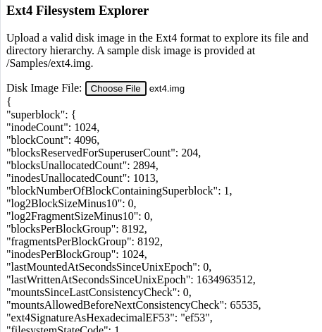

FilesystemExplorerExt4
======================

This repository is meant to someday host the code for a ext4 filesystem
explorer implemented in JavaScript and HTML5.

Right now, the code simply reads the "superblock" portion of the uploaded
disk image file and displays its contents to the screen.

See the existing FilesystemExplorerFAT12 repository for a more concrete
example of how this program is eventually meant to work.

